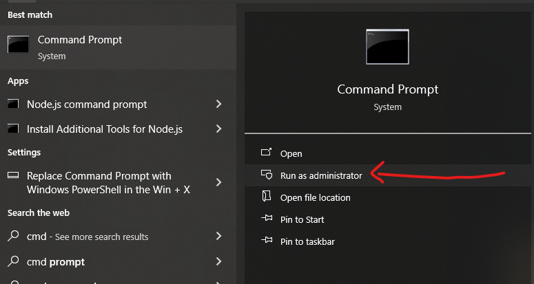
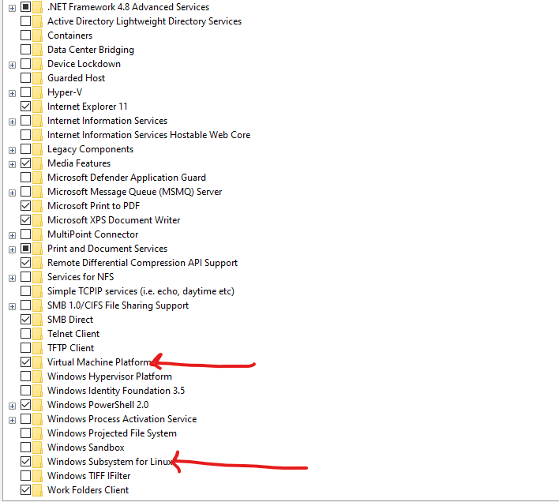
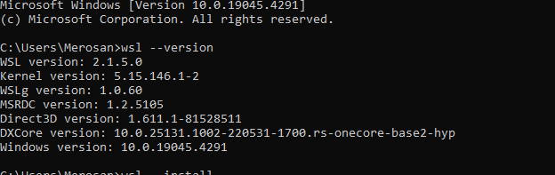
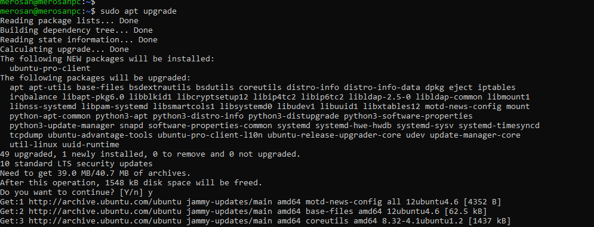
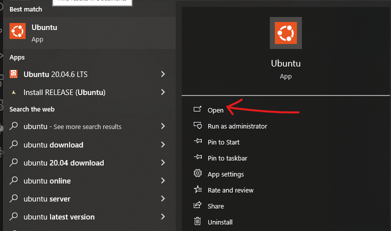

##WSL Installation in Windows
---
1. Open command prompt as "Run as administrator ".
    
2. Enter the code and Enter.
```
    wsl --install
```
3. Check its installed without any Error.
4. Enable WSL and VM Platform
 
    - Search for "Turn off or on windows features " and Enter.
    - Scroll to bottom.
    - Enable "Windows Subsytem for Liux".
    - Enable "Virtual Machine Platform".
    - click ok and exit.
    
5. Open MicroSoft Store and Search for Ubuntu.

    - Select Ubuntu 22.04. series with LTS
    - Install it and lauch
    

6. To check wsl is installed correctly, Type and Enter
    ```
        wsl --version
    ```
    
    
7. Launch Ubuntu by
    ```
        wsl --install
    ```
8. For first time create username and password for ubuntu

9. Update ubuntu to latest version by

    ```
        sudo apt install
    ```
    ```
        sudo apt upgrade
    ```
    

    
10. After you can laucnh Ubuntu directly by Ubuntu software

    

